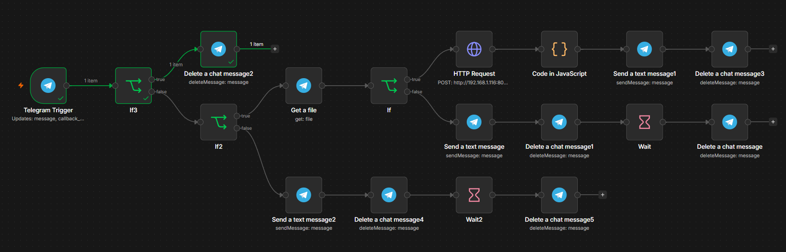

# Excel GO Parser

EN -> 
FastAPI-based Excel attendance parser that automatically extracts employee vacation (GO/PTO) information from multiple .xls/.xlsx layouts and returns structured results through a Telegram bot.

HR ->
Alat za automatsku obradu Excel evidencija radnog vremena (.xls i .xlsx).

## Example Excel Files
- [Office attendance (.xls)](examples/EVIDENCIJA RADNOG VREMENA - 01 mj - URED.xls)
- [Construction attendance (.xls)](examples/EVIDENCIJA RADNOG VREMENA - 01 mj - GRADILISTE.xls)

## DEMO


## Workflow


## Funkcionalnosti

- Podrška za `.xls` i `.xlsx` datoteke
- Automatsko prepoznavanje više različitih formata evidencija
- Izračun broja dana godišnjeg odmora (GO)
- Ispis svih datuma godišnjeg odmora po zaposleniku
- Automatsko određivanje mjeseca i godine iz naziva datoteke
- Telegram bot za slanje rezultata
- FastAPI REST API
- Docker podrška za jednostavno pokretanje

## Tehnologije

- Python
- FastAPI
- Docker
- n8n
- Pandas

## Pokretanje

```bash
docker compose up --build
```

API će biti dostupan na:

```
http://localhost:8001/docs
```

## Struktura projekta

```
api.py
Dockerfile
docker-compose.yaml
requirements.txt
workflow.png
```

## Napomena

Projekt služi za automatizaciju obrade evidencija radnog vremena i izračun godišnjih odmora bez ručnog pregledavanja Excel dokumenata.
Sva navedena imena u dokumentu su izmišljena te služe samo kao pokazni primjer.
